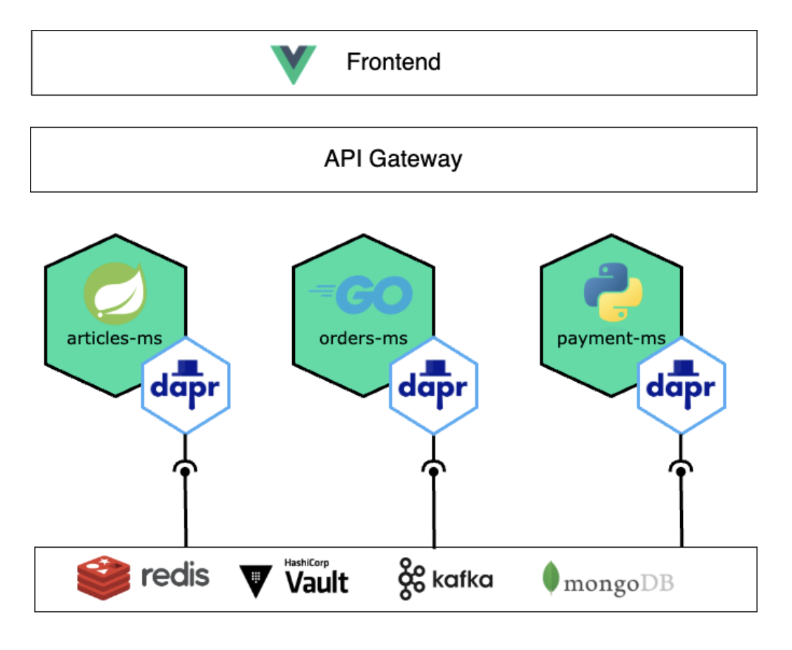

# Dapr Demonstration

Purpose of this repository is to showcase Dapr capabilities to do easy lift&shift on multiple cloud-provider.


## Example microservices
This project aims at reproducing an e-shope, it contains three microservices, using different technologies and with differents purposes.

* articles-ms-java: using Spring Boot to store articles and order drafts
* orders-ms-golang: developed in Go it stores the Order and is the entry point to initiate the Payment requests
* payment-ms-python: using Flask in Python, it simulate  a 5-seconds payment processing and then return a successful response

## Dapr usage
### Locally, using Docker compose


You can test this integration of Dapr locally using the provided `docker-compose.yml` which will:
* build the image for each microservice
* append a Dapr sidecar to each microservice and binds the correct variables
* run the redis instance used for Pub/Sub functionnality

`dapr-components/` will then be used. It contains the Component and Subscription definition for the local environment. 

### On Azure

In the folder `tf-azure`you will find the necessary terraform blocks to provision:
* AKS cluster: Kubernetes Cluster using the less costly configuration
* Azure Key Vault to store Secrets and retrieve them using Dapr
* Azure Service Bus Namespace to host the queuing section. The connection string is then stored as a secret in the Key Vault previously provisionned
* Azure Service Bus Queue to be able to publish and subscribe to topic
* Necessary Role and permissions to access the components

On the newly created cluster you will be able to configure the Initial Dapr deployment using:

```sh
dapr init -k
```

Then you can use the generated Service Account resource in the Terraform output and put it into azure directory

```sh
tf output -raw kubernetes_resource > ../azure/sa.yaml
```

The last step is to apply those resources and wait for them to be up
```sh
k apply -f azure/
k get pods
```

You can then use the microservices deployed on the AKS cluster by doing a port-forward from the services
```sh
k port-forward service/articles-ms 18080:8080 &
k port-forward service/orders-ms 18081:8081 &
```
k port-forward service/articles-ms 28080:8080 &
k port-forward service/orders-ms 28081:8081 &

### On AWS

In the folder `tf-aws` you will find the necessary Terraform blocks to provision basic resources for the poc:
- **EKS Cluster**: Kubernetes Cluster using a cost-effective configuration .
- **Necessary IAM Roles and Policies**: To grant permissions for accessing the components.


```sh
# Provisioning Resources with Terraform
cd tf-aws
terraform init
terraform apply
```
```sh
# Configure kubectl to Access EKS Cluster
aws eks --region <region> update-kubeconfig --name <cluster_name>
```
```sh
# Initialize Dapr on the EKS Cluster
dapr init -k
```

```sh
# Apply Resource Configurations and Verify
kubectl apply -f aws/
kubectl get pods
```
```sh
# Port-forwarding to Access Microservices
kubectl port-forward service/articles-ms 28080:8080 &
kubectl port-forward service/orders-ms 28081:8081 &
```


## How to test the use-cases .

### Using Postman Collection

You can use the `dapr-collection.json` and run the requests across the microservices.

### With a nice front-end ? 

Refer to [jeremyalbrecht/dapr-front](https://github.com/jeremyalbrecht/dapr-front) for the front-end used in the demonstration 